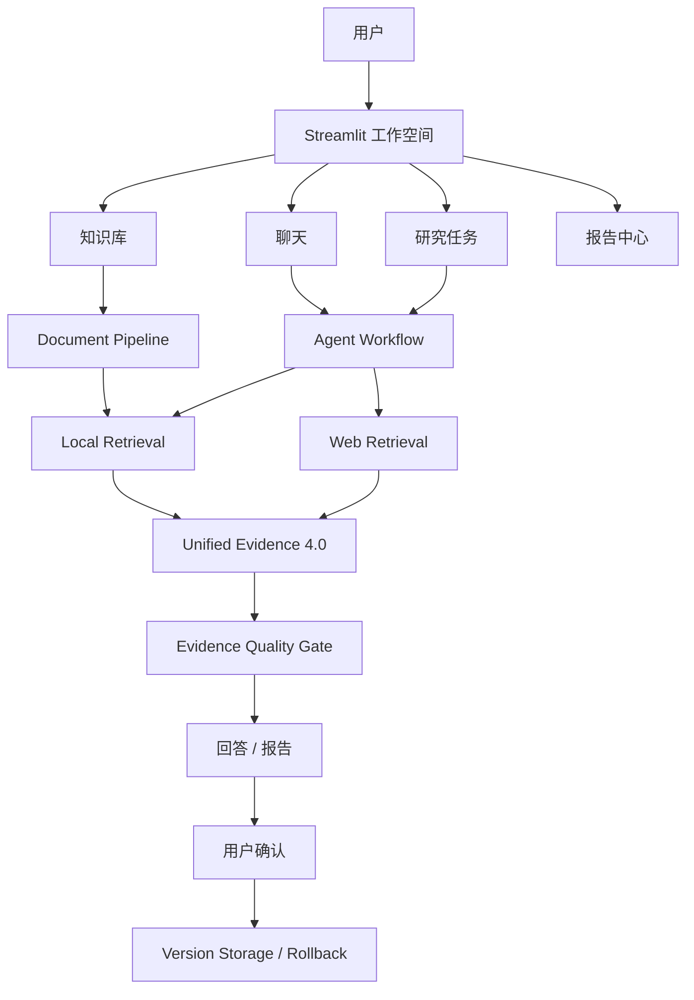

<p align="center">
  
</p>

<h1 align="center">Student Document Agent</h1>

<p align="center">
  面向学生材料的可信文档研究与报告工作空间
</p>

Student Document Agent（SDA）可以统一处理本地文档、网页资料和复杂研究任务，并将结论关联到可定位的证据。它提供知识库、聊天、研究任务、报告中心和系统状态页面，也支持经过用户确认的文档保存、版本恢复与回滚。

当前稳定版本：`v7-final-stable`

## 主要能力

- 支持 PDF、Word、Excel、PowerPoint、Markdown、TXT、JSON、CSV 和图片。
- 解析标题、段落、表格、代码块、链接、Sheet、Cell、页面和视觉区域。
- 支持 OCR、版面分析、手写识别及视觉表格提取。
- 统一执行本地检索、Web Search、指定 URL 获取和跨来源研究。
- 使用 Unified Evidence 4.0 保存文件、页码、行号、单元格、区域和网页来源。
- 提供证据充分性、时效性和冲突检查。
- 支持异步 Research Task、进度、检查点、重试、恢复和取消。
- 生成带证据的 Markdown / Word 报告。
- 写入、删除、撤销和回滚先展示预览，再由用户确认执行。
- 提供知识库、聊天、任务中心、报告中心和系统状态界面。

聊天提供三种模式：

| 模式 | 用途 |
| --- | --- |
| 普通问答 | 快速查询和文档问答 |
| 深度研究 | 执行需要多步检索的异步研究任务 |
| 报告生成 | 研究完成后生成并导出证据报告 |

## 系统架构



系统复用同一套 Document Pipeline、Retriever、Agent Runtime、Async Runtime 和 Evidence Schema，不为不同格式或页面创建重复执行链路。

## 快速开始

### 1. 环境要求

- Python 3.10 或更高版本
- 可访问 OpenAI-compatible Chat Completions API 的模型服务
- Tavily API Key（仅在需要 Web Search 时配置）

项目最终回归环境使用 Python 3.10.20。

### 2. 安装

```bash
git clone <your-repository-url>
cd student_document_agent

python -m venv .venv
source .venv/bin/activate
pip install -r requirements.txt
```

Windows PowerShell 激活虚拟环境：

```powershell
.venv\Scripts\Activate.ps1
```

### 3. 配置

```bash
cp .env.example .env
```

填写本地 `.env`：

```dotenv
LLM_API_KEY=
LLM_BASE_URL=
LLM_MODEL=

# 可选：Web Search
WEB_SEARCH_PROVIDER=tavily
TAVILY_API_KEY=
TAVILY_BASE_URL=https://api.tavily.com
WEB_SEARCH_TIMEOUT_SECONDS=8
WEB_SEARCH_DEFAULT_TOP_K=5
```

`.env` 已被 Git 忽略。不要提交 API Key、Token 或其他认证信息。

### 4. 启动后端

```bash
python -m uvicorn backend.main:app --reload --port 8000
```

- Health：<http://127.0.0.1:8000/health>
- OpenAPI / Swagger：<http://127.0.0.1:8000/docs>

### 5. 启动前端

另开一个终端：

```bash
source .venv/bin/activate
python -m streamlit run frontend/app.py
```

打开 <http://127.0.0.1:8501>。前端默认连接 `http://127.0.0.1:8000`，也可以通过环境变量覆盖：

```bash
export BACKEND_BASE_URL=http://127.0.0.1:8000
```

## 基本使用流程

1. 在“知识库”中创建知识库并上传材料。
2. 等待文件完成解析和索引。
3. 进入“新建聊天”，在输入框左侧选择聊天模式。
4. 提交问题；参考资料和处理详情默认隐藏，可按需打开。
5. 长任务可在“研究任务”中查看进度、恢复或重试。
6. 在“报告中心”预览研究结果并申请 Markdown / Word 导出。
7. 文件修改只在用户查看预览并点击确认后执行。

## 文档操作边界

聊天回答可以编辑后保存为新 Word / Markdown，也可以追加到已有可写 Word。删除文件、撤销最近修改和恢复历史版本复用同一套确认、Diff 和版本机制。

当前不提供任意 PDF / Excel 原文编辑、Word 原文覆盖或未经确认的自动写入。系统只读文件不能修改，模型输出和文档中的 `confirmed=true` 也不能代替用户确认。

## 项目结构

```text
student_document_agent/
├── Logo/                  # 项目 Logo
├── frontend/              # Streamlit 页面、组件和 API Client
├── backend/
│   ├── main.py            # FastAPI 入口
│   ├── agent.py           # Agent 工具调用与回答流程
│   ├── runtime/           # Workflow、Task、Checkpoint、Retry、Resume
│   ├── services/          # 文档、检索、证据、审批和报告服务
│   └── tools/             # 白名单工具实现
├── data/                  # 本地示例材料和运行数据目录
├── tests/                 # 单元、集成、前端和 Evaluation 测试
├── evals/                 # 固定评估案例
├── docs/                  # 版本设计、验收与架构文档
├── .env.example
├── requirements.txt
└── README.md
```

## 测试

```bash
pytest -q
```

V7 最终冻结结果：**818 passed，0 failed，0 skipped**。

测试使用隔离数据库和临时文件目录，并阻止开发者本地 Web API Key 被测试意外调用。最终架构和验收记录见：

- [V7 最终架构](docs/V7_FINAL_ARCHITECTURE.md)
- [V7 最终测试报告](docs/V7_FINAL_TEST_REPORT.md)
- [聊天文档操作与确认](docs/CHAT_DOCUMENT_ACTIONS.md)

## 安全设计

- Source Router 和 Tool Boundary 限制模型可以使用的来源与工具。
- 网页、上传文件、OCR 和视觉识别内容全部按不可信数据处理。
- Direct URL Fetch 包含 SSRF 防护。
- 高影响文件操作必须经过真实用户确认。
- Trace 和错误信息会过滤已知敏感字段。
- 写入操作使用不可变版本快照，并支持撤销和回滚。

当前项目默认面向本地单用户运行。公开部署前应在外层增加身份认证、访问控制、HTTPS、上传容量限制和持久化备份，并确认仓库中的示例材料均为合成或已匿名化数据。

## 参与开发

欢迎通过 Issue 描述问题或改进建议，也欢迎提交 Pull Request。提交前请：

1. 不提交 `.env`、密钥、真实个人材料或运行数据库。
2. 为行为变化补充必要测试。
3. 执行 `pytest -q` 并确保现有测试保持通过。
4. 保持 Unified Evidence、审批流程和安全边界兼容。

## 版本

- 稳定分支：`feature/v7-development`
- 稳定标签：`v7-final-stable`
- V5：可信通用文档 Agent
- V6：可靠研究与报告 Agent
- V7：产品化知识与研究工作空间

详细版本演进见 [V7 最终架构](docs/V7_FINAL_ARCHITECTURE.md)。
