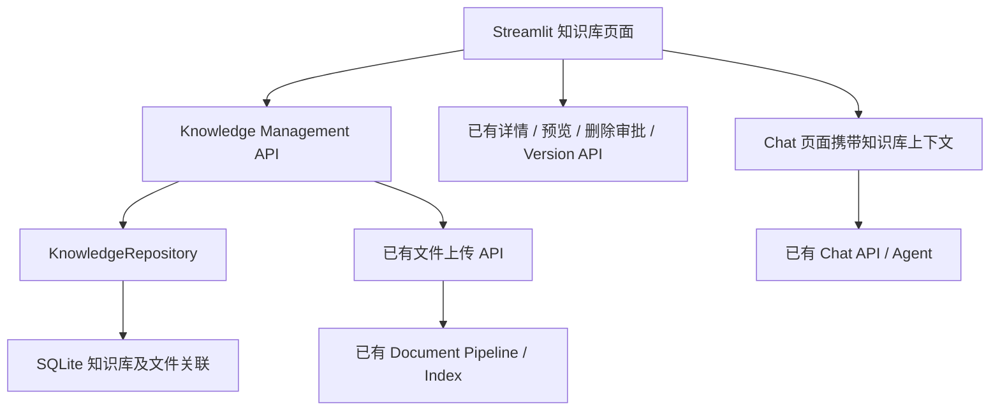

# V7.1 Knowledge Base Management

## 1. 设计背景

V7.0 提供页面骨架，文件仍以全局 Document Workspace 组织。V7.1 增加可持久化的知识库名称、描述和文件关联，让用户按用途管理已有材料。

接口审计发现，原有后端具备文件上传、列表、详情、预览、索引状态、重解析、重索引以及审批删除，但没有知识库实体、知识库 API 或文件归属关系。报告缺口后，本次补充独立管理 API 和增量迁移；不改写文档和 Agent 核心。

## 2. 知识库架构

Migration 14 `create_knowledge_bases` 只新增两张管理表：

- `knowledge_bases`：ID、唯一名称、描述、创建时间和更新时间。
- `knowledge_base_files`：知识库 ID、已有 file_id、关联时间，复合主键防止重复关联，外键保证引用完整性。

一个已有文件可以加入多个知识库，仍使用同一个 file_id、Document Block、Chunk 和索引。知识库状态从已有文件状态计算，不创建第二套生命周期：空库 Empty，存在失败文件 Failed，全部可查询 Ready，其余 Indexing。已删除文件不计数，更新时间包含文件生命周期更新。

迁移复用 `database.initialize_database()`，在后端进程启动导入数据库模块时自动执行，已执行迁移不会重复应用。无需手工建表或执行 SQL；已启动且未自动重载的后端需要重启才能加载新 API。

## 3. 页面设计

- 知识库列表：名称、描述、文件数、创建时间、更新时间、状态及进入按钮。
- 创建表单：名称 1–100 字符，描述最多 2000 字符；空名称、重名和通信失败显示明确错误。
- 详情：知识库信息、文件表、原 Document Workspace 控件、已有文件关联、上传和新建聊天入口。
- 文件表显示 Uploaded / Processing / Indexed / Failed，并保留原组件的详细生命周期、错误、详情、预览和审批操作。
- 详情通过 `selected_knowledge_base_id` 路由状态切换，复用 Streamlit 页面体系，不新增 Web 前端框架。
- 我的文档及快捷工作台保留全局文件访问，方便使用已有文件和恢复上传后关联失败的文件。
- Dashboard 显示最近加载的知识库数量，未加载时显示未知，不把未知显示为零。

## 4. API 调用

| 方法 | 路径 | 用途 |
| --- | --- | --- |
| GET | `/api/knowledge-bases` | 知识库列表及汇总 |
| POST | `/api/knowledge-bases` | 创建知识库 |
| GET | `/api/knowledge-bases/{id}` | 知识库详情 |
| GET | `/api/knowledge-bases/{id}/files` | 筛选已有文件视图中的成员 |
| POST | `/api/knowledge-bases/{id}/files` | 将已有 file_id 加入库，重复调用幂等 |
| POST | `/api/knowledge-bases/{id}/upload` | 调用已有上传处理器后保存关联 |

原有 `/api/files`、文件详情/preview、reprocess/reindex、delete、action confirm/cancel、versions/undo/rollback 和 `/api/chat` 继续使用原实现。缺失知识库/文件返回 404，重名或关联冲突返回 409，请求校验返回 422。

## 5. 文件管理流程

创建知识库 → 进入详情 → 上传或加入已有文件 → 使用原 Document Pipeline → 查看状态/预览 → 新建聊天。

文件上传沿用原文件名、类型、内容检查及全局同名冲突策略。知识库上传支持原格式和 `.md` / `.markdown`，不新增解析器。上传成功后关联失败时返回 `KNOWLEDGE_ATTACH_FAILED`，文件保留在全局文档列表，可用“加入已有文件”恢复，不自动删除文件。

删除仍是删除真实文件，需要原审批确认，会影响所有引用该文件的知识库；页面明确提示这一行为。本阶段没有实现仅移除单个知识库关联的按钮。

“新建聊天”创建新的浏览器会话，清空当前显示的消息和 Evidence，携带 `knowledge_base_id` 和名称进入 Chat 页面。该 ID 仅是前端上下文，未传入不支持此字段的 Chat API，**不保证检索只访问该知识库**。详情和聊天页面均明确说明；按库检索需后续单独评估 Retriever/Agent 的接口边界。

## 6. 修改文件

- 后端管理：`backend/knowledge_api.py`、`backend/repositories/knowledge_repository.py`。
- 后端接线：`backend/main.py` 注册路由，`backend/migrations.py` 添加 Migration 14。
- 前端：`frontend/pages/knowledge.py`、`frontend/api_client.py`、`frontend/app.py`、`frontend/pages/chat.py`、`frontend/pages/dashboard.py`。
- 组件：`frontend/components/file_panel.py` 仅增加可选上传后缀和 uploader key 参数，旧调用默认行为保留。
- 测试：`tests/test_knowledge_base_v71.py`、`tests/test_frontend_knowledge_v71.py`；现有 `test_database.py`、`test_v2_foundation.py` 更新迁移版本预期；`test_frontend_foundation_v70.py` 将知识库占位断言更新为已实现的管理页面断言。

## 7. 测试说明

新增 API 集成测试覆盖持久化、输入校验、重名、未知资源、真实 Markdown 上传及原索引复用、跨库文件列表隔离、重复关联、失败恢复和原审批删除。

新增 Streamlit AppTest 覆盖列表/详情/返回、创建校验、文件列表与上传入口、已有文件关联、生命周期映射、带上下文的新聊天、原 Chat HTTP 契约以及详情失败时不展示全局文件。所有测试使用隔离数据库和模拟前端 HTTP，不依赖在线 LLM。

原迁移回滚测试保留，人工失败迁移版本由 14 顺延至 15，验证新基线的事务回滚；没有删除旧测试或降低校验标准。

全量执行 `pytest -q`：**708 passed，0 failed，0 skipped，51.58 秒**。V7.0 基线为 683 项，本次新增 25 项。针对性检查（管理 API、前端及迁移相关测试）57 项通过。

## 8. 边界与后续

后端 Agent、Source Router、Tool Boundary、Document Parser、Index Pipeline、Retriever、Unified Evidence、Web Safety、Research Task Runtime、Approval、Version 和 Rollback 核心均未修改。没有新增 Embedding、向量数据库、Provider 或依赖。

知识库属于当前本地 Workspace 的管理资源，不提供多用户权限隔离、知识库编辑/删除、按库检索、知识库聊天历史、跨进程任务归属或知识库专用 Research Task 范围。文件状态通过页面重跑或手动刷新读取，不增加后台轮询。

V7.2 可继续前端聊天体验工作；如果需要真正限定知识库检索范围，应先确定后端接口方案和授权边界。本次不提前开发聊天体验升级。
