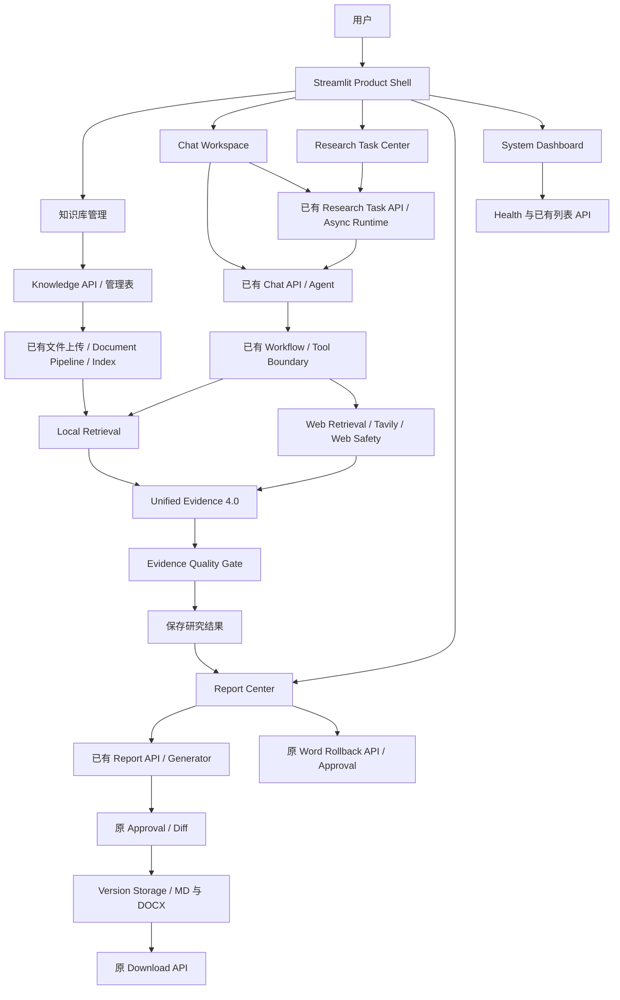

# V7 Final Architecture

## 1. V7 定位

V7 将 Student Document Agent 的 V5/V6 能力组织成 Streamlit 产品工作空间：知识库、聊天、研究任务、报告交付与只读系统状态。它复用已有后端执行链路，不创建新的 Agent、Retriever、Evidence Schema、Provider 或任务运行时。

最终代码边界以 `v7-final-stable` annotated tag 指向的提交为准。初次冻结提交为 `87c4e8c7e5b24bd5c33e727aa8147357e30c00fe`；人工体验验收后又完成了界面文案简化、Logo、默认隐藏资料与处理详情、统一文档操作确认入口、输入区模式选择器，以及默认收起的聊天功能区。标签在这些验收修订完成并通过全量回归后更新到最终提交。

## 2. V5–V7 演进

| 版本 | 定位 | 核心能力 |
| --- | --- | --- |
| V5 | Trusted General Document Agent | 多格式输入、本地/Web/URL 检索、Source Router、Tool Boundary、Unified Evidence 4.0、跨来源检索、Web Safety/SSRF |
| V6 | Reliable Research & Report Agent | Markdown、复杂任务异步执行与恢复、Evidence Quality Gate、Web Reliability、证据报告与审批导出 |
| V7 | 产品工作空间 | 统一导航、知识库管理、Chat Workspace、用户确认后的文档操作、Research Task Center、Report Center、System Dashboard |

V5 冻结 tag commit：`36ccc19aac056b337747f7c40e0674809b2b41b6`。
V6 冻结 tag commit：`f0cebebf4c85509b3feacc8976ae6f37ef6b2db6`。
V6 冻结提交是当前 V7 分支祖先。仓库存在同名 V5 分支/tag，审计命令使用 `refs/tags/v5-final-stable` 避免歧义。

## 3. 最终系统架构

该图展示能力关系，不意味着所有同步回答都会生成报告，也不意味着知识库上下文已限定检索范围。

## 4. Frontend 架构

| 模块 | 文件 | 职责 |
| --- | --- | --- |
| 入口与导航 | `frontend/app.py`、`shell.py` | Header、Sidebar、页面状态切换 |
| 首页 | `pages/dashboard.py` | 概览、原快捷工作台、系统状态区 |
| 知识库 | `pages/knowledge.py` | 创建、列表、文件关联/上传、索引状态、聊天入口 |
| 聊天 | `pages/chat.py`、`chat_workspace.py` | 三种模式、浏览器历史、消息/Evidence/研究状态 |
| 研究任务 | `pages/tasks.py`、`research_center.py` | 范围内任务发现、详情、5 秒轮询、Trace、恢复操作 |
| 报告中心 | `pages/reports.py` | 报告发现、正文、原 API 创建/审批/下载、版本和 Word 恢复 |
| 系统与统计 | `pages/settings.py`、`pages/usage.py`、`system_dashboard.py` | 只读状态投影与范围内统计 |
| HTTP 与状态 | `api_client.py`、`controller.py` | 已有 API 封装与共享会话回调 |
| 原组件 | `components/` | 文件、消息、Evidence、Trace、Task、Diff/Approval 卡片 |

前端不导入后端执行模块、不直接访问业务数据库、不生成下载文件。普通消息继续同步；深度研究/报告模式调用原研究 API。报告导出和版本恢复必须走审批。

## 5. Backend 复用与冻结审计

对比 `refs/tags/v6-final-stable` 与 V7 功能基线，backend 仅有四个差异文件：

- `backend/knowledge_api.py`：V7.1 管理 API，调用原文件能力。
- `backend/repositories/knowledge_repository.py`：知识库和已有 file_id 的关联。
- `backend/main.py`：仅两行路由导入与注册。
- `backend/migrations.py`：新增 Migration 14，创建知识库和关联表，共新增 22 行。

其余 backend 文件与 V6 冻结版本一致，包括 Source Router、Tool Scope Resolver/Tool Boundary、Cross Source Retrieval、UnifiedEvidenceFactory、Evidence Schema、Web Safety、Research Task、Async Runtime 和 Workflow。Approval、Report Generator、Version、Rollback 核心也保持不变。

知识库关联采用已有 file_id，可跨库复用同一文件，不重复 Embedding/Index。Migration 14 经原迁移机制执行；V7 Final 不再修改 schema。

## 6. 核心语义与明确限制

- 知识库是管理上下文，尚未提供按库限制检索或多用户权限隔离。
- 聊天历史仅保存在当前浏览器会话，不能等同持久、跨设备历史。
- 任务/报告列表来自已知会话，每会话最多最近 100 个任务；支持已知 ID 打开，不是全局列表。
- Timeline 只展示实际 Trace 记录和当前状态；Trace 有返回条数限制，不推测未出现阶段完成。
- 报告结构化预览不等于回滚后的 Word 文件内容；下载取批准导出的当前实际文件。
- Word 支持原 Rollback；Markdown 仅展示已有版本，没有新增恢复实现。
- Backend Online 仅表示 `/health` 成功。Provider/模型/组件缺少公开状态接口，显示未验证或无接口，不能据此承诺 Connected/Ready。
- 系统统计失败显示未知而非零；不读取 `.env` 或认证配置，不显示原始认证异常。

## 7. 用户完整流程

创建知识库 → 上传材料 → 原 Document Pipeline 解析与索引 → 从知识库新建聊天 → 选择研究/报告模式 → 原 Async Runtime 执行 Agent 与工具 → 查看 Unified Evidence 和质量结果 → 原 Report API 生成草稿 → 预览申请导出 → 原审批确认 → 版本记录和 Markdown/Word 下载。

取消、重试、恢复由任务详情提供，执行资格与执行过程均以原后端为准。该流程已通过 Final Demo 自动化验收，具体测试替代边界见 `V7_FINAL_TEST_REPORT.md`。

## 8. 未来扩展方向

后续可独立设计服务端持久会话历史、全局资源分页、按知识库检索契约、公开且无秘密的 Provider/组件健康接口、流式响应和更完整的可访问性/浏览器测试。需要修改冻结后端的事项应单独评审，不在本次实现。

V7 Final 完成后停止，不自动开发 V8。
